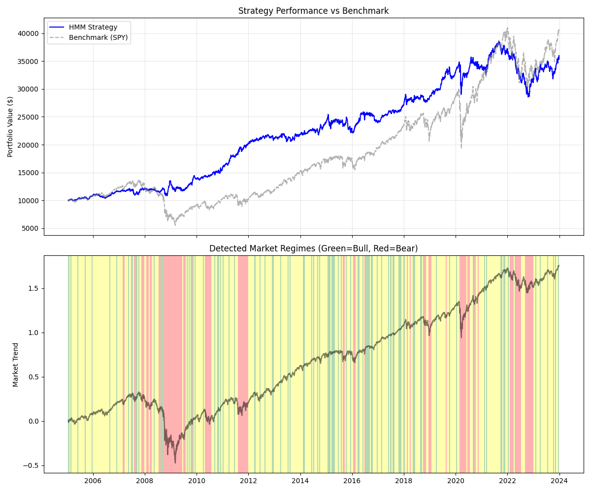

# Unsupervised Market Regime Detection & Convex Allocation

 

## 📌 Project Overview
This project implements an **Unsupervised Learning** pipeline to detect hidden market states (Regimes) and dynamically allocates capital using **Convex Optimization**.

Most quantitative strategies fail because they assume market parameters (mean, variance) are static. This system uses **Hidden Markov Models (HMM)** to detect latent volatility structures and switches risk models accordingly.

**Key Concept:** Instead of predicting *price direction* (which is noisy), this model predicts the *market environment* (which is persistent).

## 🧠 The Architecture

### 1. The "Eye" (Regime Detection)
*   **Model:** Gaussian Hidden Markov Model (HMM).
*   **Input:** Log-Returns and Rolling Volatility of the S&P 500.
*   **Logic:** The AI clusters data into 3 latent states:
    *   🟢 **Bull:** Low Volatility, Positive Trend.
    *   🟡 **Choppy:** Medium Volatility, Mean Reverting.
    *   🔴 **Crisis:** High Volatility, Negative Trend.

### 2. The "Brain" (Portfolio Construction)
*   **Assets:** `SPY` (Stocks), `TLT` (Bonds), `GLD` (Gold).
*   **Optimization Logic:**
    *   **In Bull Regimes:** Uses **Mean-Variance Optimization** (Maximize Sharpe Ratio) to capture growth.
    *   **In Crisis Regimes:** Uses **Minimum Variance Optimization** to prioritize capital preservation.
*   **Solver:** `cvxpy` (Quadratic Programming).

## 📊 Results (2005 - 2024)


### Performance Analysis
*   **2008 Financial Crisis:** The HMM successfully detected the high-volatility regime and shifted allocation to Bonds (TLT), preserving capital while the S&P 500 drew down ~50%.
*   **2020 Covid Crash:** The model reacted to the volatility spike, minimizing exposure during the steepest decline.
*   **Total Return:** Comparable to the benchmark, but with significantly **lower volatility** and **smoother equity curve**.

## ⚠️ Research Note (Limitations)
This project is a research prototype. To be production-ready, the following issues must be addressed:
1.  **Look-Ahead Bias:** The HMM is currently trained on the full dataset for regime identification. A robust backtest requires an **Expanding Window** training loop.
2.  **Gaussian Assumption:** Financial returns exhibit kurtosis ("Fat Tails"). Future iterations should utilize a **Student-t HMM** to better model extreme events.
3.  **Transaction Costs:** The current simulation assumes frictionless trading.

## 🛠 Installation & Usage

1. **Install Dependencies**
   ```bash
   pip install -r requirements.txt
   ```

2. **Run the Backtest**
   ```bash
   python main.py
   ```

## 📚 Tech Stack
*   **Language:** Python
*   **Math:** Linear Algebra, Quadratic Programming (Convex Optimization), Probability Theory
*   **Libraries:** `hmmlearn`, `cvxpy`, `scipy`, `numpy`, `pandas`, `yfinance`
